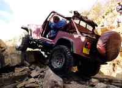
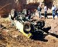
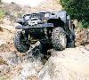
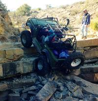

# Las Cruces '98: The Chile Challenge
<H4>by [Terry L. Howe]()</H4>

Phil Collard on Tabasco Twister
There were a lot of changes at this years Southwest 4 Wheel Drive
Associations Winter Meeting in Las Cruces, New Mexico.  The
association was told only a few months before the event that the
BLM was shutting down hundreds of acres of land  which meant
the runs that were planned for the area would have to be moved.
The closure put an end to the infamous "Wolf Run" and "Guardian".
The clubs in the area worked hard to develop new trails that could
match the difficulty of the trails that were closed.
Without a doubt, they succeeded.
 
[The Gauntlet](lc98_gauntlet.html)

|  | [[The Gauntlet](lc98_gauntlet.html)](lc98_gauntlet.html)I always felt[[The Gauntlet](lc98_gauntlet.html)](lc98_gauntlet.html)aka Coyote
Canyon was underrated.  The trail has given me more problems than
Wolf Run, Broad Canyon, or Amatista Ledges |
| --- | --- |
|  | [[Amatista Ledges](lc98_amatista.html)](lc98_amatista.html)True to its name,[[Amatista Ledges](lc98_amatista.html)](lc98_amatista.html)begins with a drop off a ledge which leads to drop off after drop off.
Picking the wrong line off one of these ledges could easily
lead to a roll-over. |
|  | [[Habenero Falls](lc98_habenero.html)](lc98_habenero.html)I watched six trucks try the first giant stone step of[[Habenero Falls](lc98_habenero.html)](lc98_habenero.html).  Three trucks made
it, two broke drive shafts, and one broke a front axle. |
|  | [[[Tabasco Twister](lc98_tabasco.html)](lc98_tabasco.html)](lc98_tabasco.html)The[[[Tabasco Twister](lc98_tabasco.html)](lc98_tabasco.html)](lc98_tabasco.html)features a lot of good hard four wheeling and two extreme ledges to climb.
Even our well prepared group had difficulties
stomaching the heat of the[[[Tabasco Twister](lc98_tabasco.html)](lc98_tabasco.html)](lc98_tabasco.html). |

Wolf Run, Broad Canyon, or Amatista Ledges
 
[Amatista Ledges](lc98_amatista.html)

True to its name, [Amatista Ledges](lc98_amatista.html)
begins with a drop off a ledge which leads to drop off after drop off.
Picking the wrong line off one of these ledges could easily
lead to a roll-over.
 
[Habenero Falls](lc98_habenero.html)

I watched six trucks try the first giant stone step of
[Habenero Falls](lc98_habenero.html).  Three trucks made
it, two broke drive shafts, and one broke a front axle.
 
[Tabasco Twister](lc98_tabasco.html)

The
[Tabasco Twister](lc98_tabasco.html)
features a lot of good hard four wheeling and two extreme ledges to climb.
Even our well prepared group had difficulties
stomaching the heat of the [Tabasco Twister](lc98_tabasco.html).
### Trail Closures
The only way to stop [closures](lc98_closure.html) is
by doing something about it.  Please help keep the beautiful and
challenging trails of Las Cruces open!
### Contributors
Thanks to Dave Vest for many of the pictures in this report.

Glenn Wakefield on Tabasco Twister