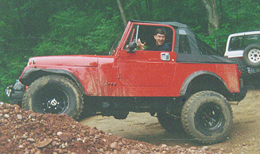
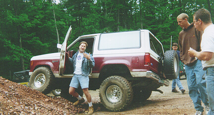

<TITLE>Trail Report: LIOR Paine Hill</TITLE>
# Trail Report: LIOR Paine Hill

Well with a name like "Paine Hill" you would think it was good,
wouldn't you?  Well we must have missed the pain, because it wasn't
much more than a two wheel drive road.  While we were looking around,
Greg broke his his drag link.  It took us a while to figure out how
to fix it with a hi-lift jack handle.  As soon as his TLC was workable
again, we headed out so he could get it repaired.  While fixing the
drag link I took a couple of pictures of people messing around on a
dirt pile.  Afterwards we stopped by Mt. Lamentation and it wasn't
long before Mark Sailer tore a hole in a side wall.  Just one of those
days I suppose.

<ADDRESS>
Author: Terry L Howe [(txh3202@worldnet.att.net)](mailto:txh3202@worldnet.att.net)
</ADDRESS>
June 16, 1996

