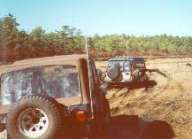
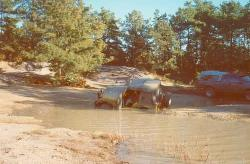
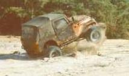
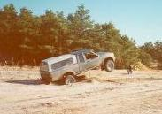
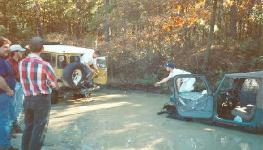

<TITLE>Trail Report: LIOR Pine Barrens</TITLE>
# Trail Report: LIOR Pine Barrens
## by Greg Passannante
We all met at the train bridge at
9:30am.  There were a total of ten trucks.  Jim
lead us across the street to a trail where there
were a few mud holes that didn't give us any problems.
Then we came to a open field that looked a little muddy
with some water.  Jim headed in first to show us all
how to bury his Dodge in the mud.  I entered with everyone
following and we all got stuck except for three trucks.
Paul hooked onto Jim to winch out, but toasted his ignition
module. Eric winched himself out, Keith and myself were
strapped out.
Terry, Mike, and Gonzalo
We all were free except the Jim's Dodge, he took a little longer.
Mike, John, and Gonzalo were pulling each other out while Paul was
doing a trail repair on his electrical system.  Eric and Keith
decided to go a little crazy and race each other around the field
(Keith came back first).
Keith in deep
We were there for an hour or so and we broke for lunch once everyone
was on dry land.  After lunch, we then headed on the trail again and
found a sunken lake.  We played here for a while, climbing the eroded
hills.  This was a nice place to test your skills climbing loose dirt
hills.  On the way out Eric showed us the undercarriage of the Jeep by
trying to climb a steep hill.

Eric and John catch some air
We drove some more till we came to the end of the trail.  At the end
was a sand mining operation where we got out to look at the man made
lake.  At this spot Keith, Eric, and John launched there trucks over
a small jump.  Eric found a bent front driveshaft when he landed.
Greg tosses Terry the strap
Well we headed out to another spot Jim knew about, we backed tracked
to the main road to cross over to this huge playground for trucks and
motorcylces.  We were amazed at how many trucks were there.  There
were a bunch of mud holes, I think there was one for everyone.  We
all split up to find what we all like best.  I was climbing the dirt
with Paul and Mike while everyone else was driving around.  Little
Gonzy was driving his dads Ford around like a pro.  We found a spot
where Mike and Paul got this really nice back tire aerial shot.  The
tire was off the ground on the Jeep about two and a half feet.
Couple of more photos were shot and off to another waterhole.  Paul
went through and fell to the left side (I think it scared him for a
while) and his Bronco took on some water in the cab.  He tried to
get me to follow his tracks.  I criss crossed his tracks to find
the water going over my hood.  I plowed through and made it also
(thank God).
Well it was getting late and we all decided to leave and get some
pizza before heading home.  LIOR will come back to this spot.  Thanks
everyone for a great day and thanks Jim for a cool Trail.
The people that attended the trail ride were:
- Jim Guld - '95 Dodge
- Greg Passannante - '78 Landcruiser
John Schlachter - '89 Toyota PU
- Paul Davila - '77 Bronco
Keith Huntington - '80 CJ-5
- Eric Johansen - '78 CJ-7
Gonzalo Cantos - '89 Ford PU
- Terry Howe - '81 CJ-7
Mike Medeirous - '?? Cherokee
- Mike Taliento - '?? Trooper

<ADDRESS>
Edited by: Terry L Howe [(txh3202@worldnet.att.net)](mailto:txh3202@worldnet.att.net)
</ADDRESS>
Feb 19, 1996

