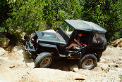

<TITLE>Trail Report: Big Horn:Mad Dog</TITLE>
# Trail Report: Big Horn:Mad Dog

Ray takes the hard left line up the first obstacle on Mad Dog.  This
line looks like the easiest, but it is probably the hardest.

On the way down Mad Dog, there is a good spot to catch air when your
front tire drops in a hole.  Care is required to get the front over
a rock on the drivers side without denting up the passenger side.
It is especially hard if you are open and have tall gears as Sean
found out, he escaped with no body damge.

Here is a shot that doesn't do justice to the second obstacle on
Mad Dog.  Paul walked right up in his CJ-2A and I had a tough time
with this one.

<ADDRESS>
Author: Terry L Howe [(txh3202@worldnet.att.net)](mailto:txh3202@worldnet.att.net)
</ADDRESS>
August 11, 1997

