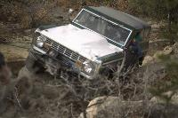

# Mad Dog 2/98

                            Mad Dog Trip

                          February 1, 1998

                                 by

                              Cindy Beaudean

Mad Dog...This was a trip to check out all the work that Dave Vest had been
doing on his Bronco to improve it's performance...Looks like the hard work
he put into it paid off...We had a beautiful day to spend playing...There
was Ray, Leah, Rosie and Nathan Bork in the blue Bronco, Dave and his dog
Buffy in the green and white Bronco, Paul and Cindy in the good old '45
flat fender...
All three had few problems climbing the front part of Mad Dog so we decided
to have a go at the back side...Again all three just had a fun time
climbing around.

