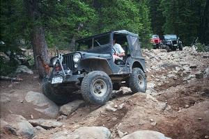
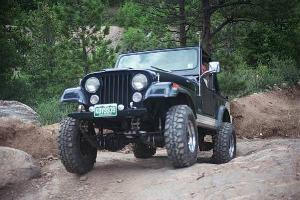
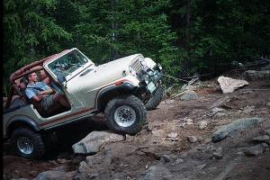

# Spring Creek 6/19/99

June 19, 1999

by Cindy Beaudean

AN ALL JEEP DAY...and what a day it was...Paul and I met up with those brave
adventurous jeep owners at the McDonalds on the north side of town...Audrey,
John, Kevin, John with his dad John, Ryan, Brian and Mike...up we headed
towards the edge of Idaho Springs.

### Mystery Trip 1

This is a trip that Paul and Jake scouted out.  It is on the outskirts of
Idaho Springs and has 2 designations... Locker Hill or Guard Rail Trail ...
take your pick ...  we had along with us as guest John Gamby's dad from
Nebraska, and three Air Force cadets...Ryan, Brian and Mike.  The first
obstacle was interesting especially for Ryan and Brian but they did a
great job and made through.  It was a fun run through some old mining
ruins with a fun hill at the end of it where we turned around
and went back down.

### Mystery Trip 2

A side road before Spring Creek trail that some people call Silver Creek.
We had lunch at the bottom of this obstacle.  All but Mike tried the hill
and made it no problem.

### Spring Creek

We left the two vehicles which Mike and Ryan were driving and Ryan, Brian
and Mike rode up the Spring Creek road with Audrey, John and Kevin.
We met some people coming down from Spring Creek as it has become even more
difficult.  But all of our vehicles made it.  John G. being open had some
trouble but still made it up.  John put a winch on for safety when the way
he decided to try turned out to be a bit hairier than he had originally
thought.  The rain held off until we started back...it was a long day but
one of some great 4 wheeling and lots of fun...Thank you to those who were
able to make it...It proved to be a GREAT JEEP DAY...  

