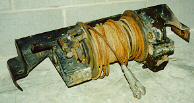
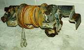

# Jeep Winches: Koenig PTO Winch
<H4>by [Terry L. Howe]()</H4>

From the left side of the winch, you can see the brake mechanism.
The original brake handle broke off this winch and a replacement
has been welded on.

From the right side of the winch, you can see the PTO input for
the winch.  The PTO shaft comes in below and to the right of the
winch.  This winch is bolted to a CJ mount which is slightly bent.